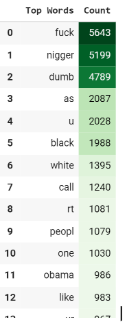

# Project Akhir Big Data
TWITTER CYBERBULLYING RECOGNITION USING NATURAL LANGUAGE PROCESSING, MACHINE LEARNING AND APACHE SPARK

Kelompok 7 TI 3C :

- Welson Mario / 18
- Yudas Malabi / 20

---
### Penjelasan Proyek
Seiring dengan meningkatnya penggunaan media sosial di setiap kelompok usia, sebagian besar masyarakat mengandalkan media sosial salah satunya twitter untuk berkomunikasi sehari-hari. 

Ketersebaran media sosial berarti bahwa cyberbullying dapat secara efektif mempengaruhi siapa saja, kapan saja, dan di mana saja, dan keanoniman relatif internet membuat serangan pribadi semacam itu lebih sulit dihentikan dibandingkan dengan bullying tradisional. 

Hal ini dapat dilawan dengan menciptakan model pembelajaran mesin untuk secara otomatis mengidentifikasi tweet yang berpotensi berbahaya serta menganalisis pola-pola kebencian.

---
### Cara Setup & Running
1. Clone repository github: 
    <code>git clone https://github.com/Yudas1337/project-big-data-2023</code>
2. Buka <code>colab.research.google.com</code>
3. Upload file <code>cyberbullying_tweet_recognition_project.ipynb</code> yang telah di download sebelumnya ke google colab anda.
4. Jalankan tiap kode pada cell satu per satu, mulai dari import hingga hasil akhir.

---
### Penjelasan Metode
1. melakukan import library yang dibutuhkan

     

2. Load dan filtering dataset sesuai dengan klasifikasinya menggunakan apache spark

     

3. Memasukkan ke dalam temporary table di spark agar dapat dikonversi ke pandas

     

4. Natural Language Processing

    Natural Language Processing (NLP) adalah sekelompok teknik yang digunakan untuk memungkinkan komputer memahami bahasa alami yang belum diproses yang diucapkan oleh orang-orang dengan mengumpulkan struktur tata bahasa dan makna dari input.

    NLP yang digunakan untuk project kali ini adalah penghilangan stopword, stemming, sentiment analysis, penghilangan simbol dan emoji, serta vektorisasi tweet yang telah dibersihkan. Hal ini bertujuan agar dataset yang digunakan dapat diuji ke dalam pemodelan machine learning.

    Berikut adalah beberapa implementasi NLP:

     

     

     

5. Machine Learning Models:
    * Logistic Regression

        Logistic Regression adalah salah satu algoritma klasifikasi yang umum digunakan dalam pembelajaran mesin. Kegunaan utama dari Logistic Regression adalah untuk memodelkan dan memprediksi probabilitas kejadian suatu kategori atau kelas berdasarkan variabel input atau fitur yang diberikan.

        

    * Support Vector Classifier

        LinearSVC (Linear Support Vector Classification) adalah algoritma klasifikasi yang digunakan untuk memisahkan dua kelas berdasarkan fitur atau variabel input yang diberikan.

        

    * Naive Bayes Classifier

        MultinomialNB adalah algoritma klasifikasi yang berguna dalam tugas klasifikasi teks dan pemrosesan bahasa alami. Ia memiliki keunggulan dalam efisiensi komputasional, kestabilan terhadap fitur yang tidak relevan, dan kemampuan untuk menangani klasifikasi multi kelas

        

    * Decision Tree Classifier
        DecisionTreeClassifier adalah algoritma klasifikasi yang menggunakan struktur pohon keputusan untuk memodelkan dan memprediksi hubungan antara fitur atau variabel input dengan label atau kelas target.

        
     
---
### Hasil Praktikum
1. Visualisasi Data
    * Dataframe Tabel

        

    * Bar Chart

        

    * Word Cloud

        

    * Confusion Matrix Tabel

        

2. Classification Report

    

    Dari hasil pemodelan masing-masing machine learning yang telah diimplementasikan, dapat disimpulkan bahwa metode Logistic Regression mendapatkan nilai terbaik dari model lainnya dengan nilai 0.83

    Dan dari klasifikasi report diatas, kita bisa mendapatkan f1-score dari masing” kategori. Dapat disimpulkan bahwa kategori cyberbullying yang paling sering terjadi adalah kategori ethnicity.
